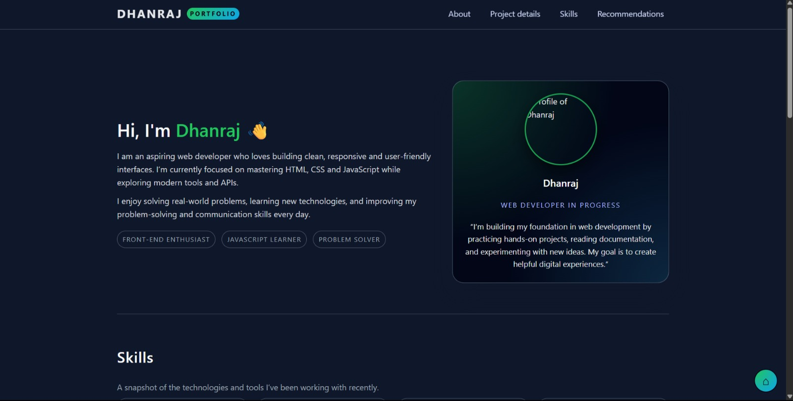
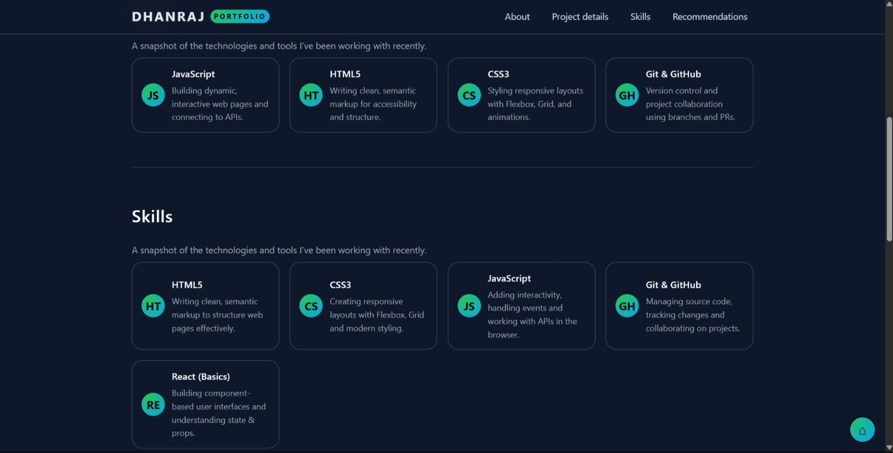
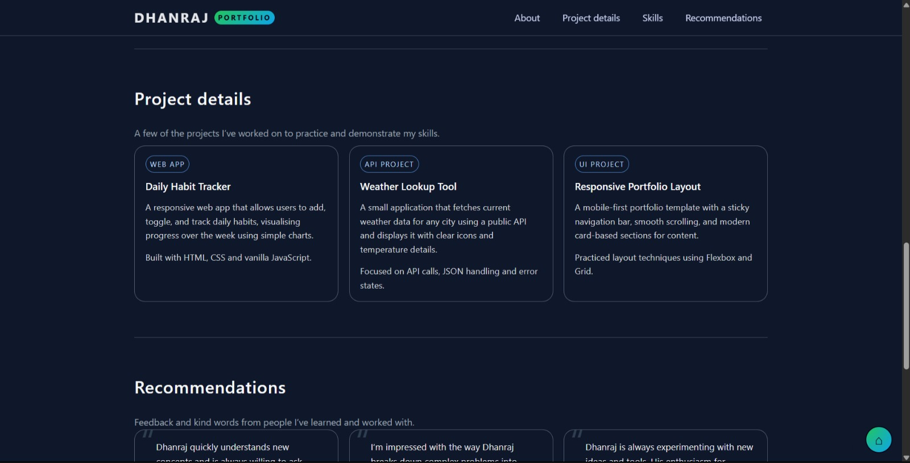
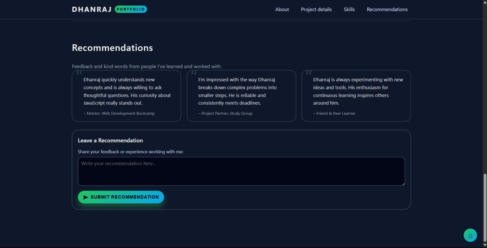

# Web-fundamentals-Mini-Project-
THIS IS COLLAGE RELATED MINI PROJECT 
# 🚀 My Personal Portfolio

A sleek, modern, and fully responsive portfolio website designed to showcase my journey, projects, and technical skills. Built from scratch using core web technologies.

---

## ✨ Features
* **Fully Responsive:** Optimized for mobile, tablet, and desktop screens.
* **Dynamic Navigation:** Smooth scrolling and an active-link indicator.
* **Project Showcase:** A clean grid layout featuring my best work with links to source code.
* **Contact Form:** A functional way for visitors to reach out.
* **Dark/Light Mode:** (Optional: include if you added a theme switcher).
* **Optimized Performance:** Fast loading times and semantic HTML for SEO.

## 🛠️ Technologies Used
* **HTML5:** Semantic structure for better accessibility and SEO.
* **CSS3:** Custom styling using Flexbox, Grid, and CSS Variables.
* **JavaScript (ES6+):** Interactive elements and DOM manipulation.
* **FontAwesome:** For intuitive iconography.
* **Google Fonts:** For modern typography.

## 📸 Output Screenshot

